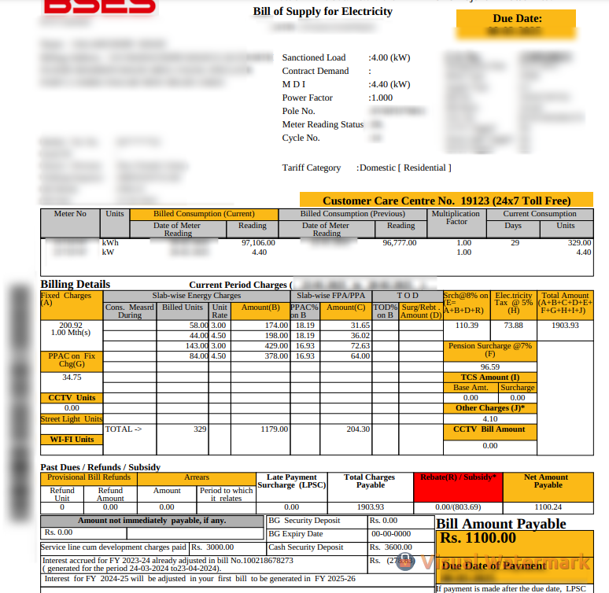
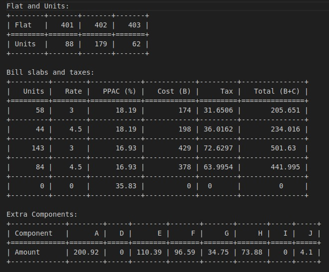
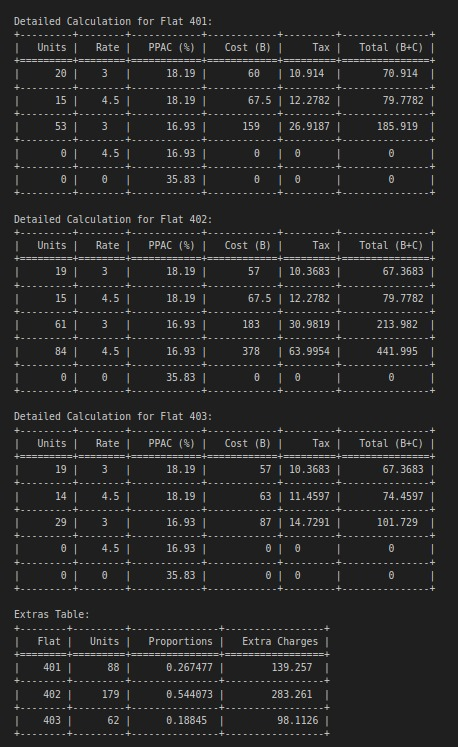
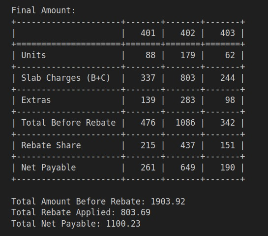

# 🔌 Smart Electricity Bill Splitter for Sub-Metered Flats

### 🧮 Fairly Split Complex Electricity Bills Based on Actual Usage — Especially in Sub-Meter Setups

---

## 📖 What is this?

This is a **Python-based utility** to help tenants or landlords **fairly split electricity bills** among flats using **sub-meter readings**, especially when there's only **one official electricity meter** (due to connection limits) and **multiple flats** share the connection.

It accounts for:
- ✅ Slab-based energy charges (tiered billing)
- ✅ Different PPAC % on each slab
- ✅ Fixed components distributed proportionally
- ✅ Rebates/subsidies adjusted fairly
- ✅ Custom flat names and units
- ✅ Automatic `.txt` and `.pdf` bill generation

---

## 🤔 Why this?

In many Indian cities (like Delhi), electricity boards (e.g. BSES) allow only a limited number of connections per building. So, multiple tenants on a shared connection often get overcharged when landlords manually split bills with inaccurate or unfair assumptions (like applying the highest slab rate to all units).

This tool was built to solve that problem — accurately and transparently.

---

## ⚙️ Features

- 🧮 Custom slabs with rate + PPAC per slab
- 📊 Splits fixed components proportionally
- 🎯 Works for any number of flats with custom names
- 📉 Handles rebates or subsidies fairly
- 🧾 Outputs `.txt` and `.pdf` reports
- 📁 Saves output in organized folder structure: `data/Feb_2025/Bill_Feb_2025_Floor_4.pdf`

---

## 🧠 How the Bill is Calculated

This tool simulates how real electricity bills work:

### 1. 🔢 Slab-wise Energy Charge Calculation
- The total units consumed across all flats are split into slabs.
- Each slab has a **rate per unit** and a **PPAC %** (tax).
- Units are distributed across flats fairly in each slab (as per availability).
- Each slab's energy cost and PPAC tax is added up for each flat.

Example:

| Slab        | Units | Rate | PPAC % | Flat A Units | Cost | Tax  |
|-------------|-------|------|--------|--------------|------|------|
| Slab 1      | 198   | 3.0  | 35.83% | 66 each      | 198  | 71   |
| Slab 2      | 199   | 4.5  | 35.83% | 66 each      | 297  | 106  |

---

### 2. 📦 Fixed Components

Components like `A`, `D`, `E`, `F`, etc. are additional charges (in ₹).  
These are **not based on slab or unit**, so we divide them **proportionally by unit consumption**.

If total units = 1000 and flat A uses 300, they pay 30% of each fixed component.

---

### 3. 🎁 Rebate / Subsidy

You can enter a **rebate amount** (like ₹400). The program divides this proportionally across flats based on unit consumption.

So a flat using 60% of total units gets 60% of the rebate deducted.

---

## 💡 Example Scenario

Suppose:
- You live on Floor 4 with 3 flats (401, 402, 403)
- Shared meter: 1000 units
- Actual usage: 401 (550), 402 (650), 403 (150)
- BSES bill total: ₹10,000 including PPAC, surcharges, rebate etc.

The landlord should split that bill **fairly**, but many overcharge each tenant equally or unfairly.

> This tool calculates the true payable amount for each flat based on all components.

---

### 🔍 Sample Prompts You Can Try

After running the program, try answering these for the example:

ℹ️ Note:
The values shown within [brackets] are default values.
If you press Enter without typing anything, the program will automatically use that default.

Enter Number of Flats [3]: 3
Enter Name of Flat 1 [401]: 401
Enter Name of Flat 2 [402]: 402
Enter Name of Flat 3 [403]: 403

Enter Component B slab 1 units [198]: 58
Enter Component B slab 1 rate [3]: 3
Enter PPAC % for slab 1 [35.83]: 18.19

Enter Component B slab 2 units [199]: 44
Enter Component B slab 2 rate [4.5]: 4.5
Enter PPAC % for slab 2 [35.83]: 18.19

Enter Component B slab 3 units [396]: 143
Enter Component B slab 3 rate [3]: 3
Enter PPAC % for slab 3 [35.83]: 16.93

Enter Component B slab 4 units [397]: 84
Enter Component B slab 4 rate [4.5]: 4.5
Enter PPAC % for slab 4 [35.83]: 16.93

Enter Component B slab 5 units [160]: 0
Enter Component B slab 5 rate [8]: 0
Enter PPAC % for slab 5 [35.83]: 35.83

Enter Component A [198.28]: 200.92
Enter Component D [0]: 0
Enter Component E [705.34]: 110.39
Enter Component F [617.18]: 96.59
Enter Component G [71.04]: 34.75
Enter Component H [619.8]: 73.88
Enter Component I [0]: 0
Enter Component J [2.3]: 4.1

Enter 401 units [550]: 88
Enter 402 units [650]: 179
Enter 403 units [150]: 62

Enter total Rebate/Subsidy amount [0]: 803.69

## 🔍 Example: Sample Bill + Output

Below is a sample scanned bill that we used to test this tool:

### 📸 Input Bill Image

---

### 📄 Generated Output (Text Summary)

The entered bill information (slabs and components) from the output `.txt` file created looks like the following snippet:

The detailed calculations for each flat looks like this.

And the final amount to be paid by each flat looks like the following.

---

